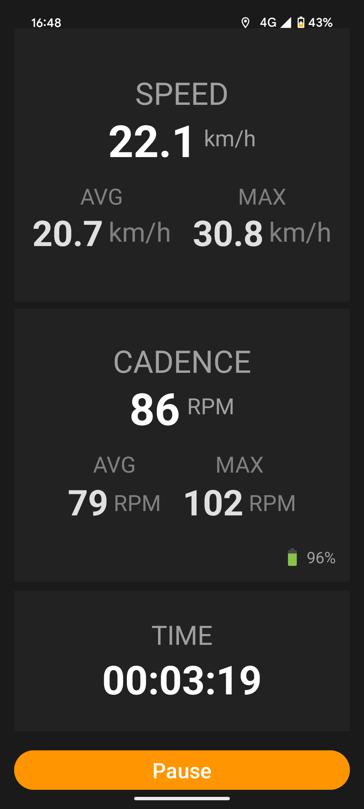

# Cadence and Speed display

An Android application designed to read data from the [Magene Cadence Sensor](https://www.magene.com/en/all-products/60-s314-speed-cadence-dual-mode-sensor.html) and display the device’s current speed in real time.

---

### Why I Built It 🚴

I created this app because the official Magene application didn’t fully meet my cycling needs. I wanted something easier to see, with the speed display at the same time.

This project was also a personal experiment: it’s the first time I used **Gemini AI** for roughly **80% of the development process**. Since I was working with technologies I’m not very familiar with, it was a great boost for a small personal project.

Overall, I’m really happy with how it turned out.

