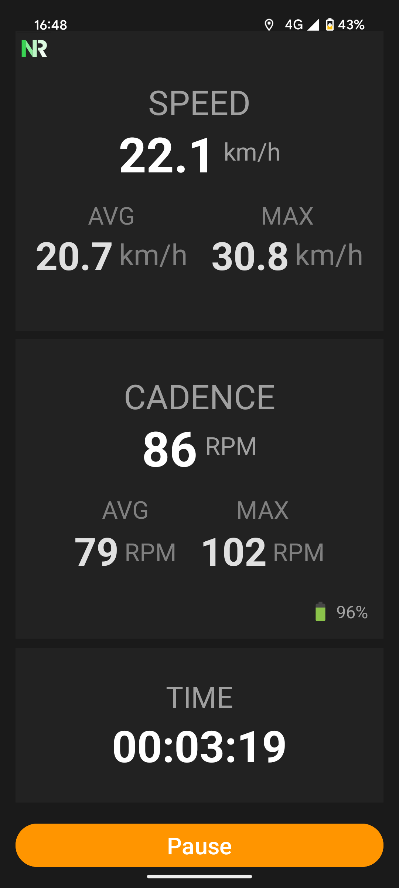

# Cadence and Speed display

An Android application designed to read data from the [Magene Cadence Sensor](https://www.magene.com/en/all-products/60-s314-speed-cadence-dual-mode-sensor.html) and display the device’s current speed in real time.

---

### Why I Built It 🚴

I created this app because the official Magene application didn’t fully meet my cycling needs. I wanted something easier to see, with the speed display at the same time.

First time "Vibe Coding" (even if I hate the term) using Gemini integrated in Android Studio. Honestly, did great at the beginning, but you need to know what you are doing. After only a few minutes, it started deleting some part of my code that I had to manually add again and again and again.

